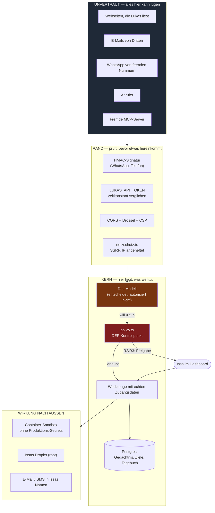

# Sicherheitsmodell

Was dieses Dokument leistet: es sagt, **wem** und **was** vertraut wird, wo
die Grenzen verlaufen, was absichtlich offen bleibt — und was danach noch an
Risiko übrig ist.

Was es nicht leistet: es beschreibt keinen Wunschzustand. Jede Aussage hier
lässt sich im Code nachlesen; wo Code und Absicht auseinanderlaufen, steht es
dabei. Kommentare sind keine Beweise, und eine Doku, die schöner ist als das
System, ist schlimmer als gar keine — dann rechnet man mit einem Netz, das
nicht da ist.

---

## 1. Der Leitsatz

> **Ein Sprachmodell ist niemals ein Autorisierungsserver.**

Lukas entscheidet, **was** er tun möchte. Ob es ausgeführt wird, entscheidet
Code — nachdem das Modell gesprochen hat und **bevor** das Werkzeug mit echten
Zugangsdaten läuft. Diese Reihenfolge ist der ganze Punkt: eine Anweisung im
Prompt ("tu das bitte nicht") ist eine Bitte, eine Prüfung im Code ist eine
Grenze.

Die Prüfung sitzt in `artifacts/api-server/src/lib/policy.ts` und wird in
`executeLukasTool()` aufgerufen, bevor irgendein Werkzeug seine Arbeit
aufnimmt — auch bevor Werkzeuge fremder MCP-Server laufen.

---

## 2. Vertrauensgrenzen

**Die wichtigste Linie im Bild** ist die zwischen `modell` und `policy`. Alles,
was das Modell gelesen hat — jede Webseite, jede Mail, jeder fremde Chat —
liegt in seinem Kontext und ist von Issas eigenen Worten nicht zu
unterscheiden. Deshalb darf nichts, was das Modell **sagt**, eine Stufe
herabsetzen oder eine Freigabe erzeugen.

---

## 3. Wer ist wer

| Rolle | Woran erkannt | Bekommt |
|---|---|---|
| **Issa (Dashboard)** | `LUKAS_API_TOKEN`, zeitkonstant verglichen | alles |
| **Issa (WhatsApp)** | Absendernummer aus dem **von Meta signierten** Webhook, gegen `WHATSAPP_OWNER_NUMBERS` | alles |
| **Fremder (WhatsApp)** | jede andere Nummer | Gespräch. **Keine Werkzeuge** — leeres Array im Modellaufruf, nicht bloß eine Anweisung. Eigener Gesprächsfaden, öffentlicher Prompt |
| **Anrufer** | Nummer im SIP-From-Header | privat **oder** öffentlich — ⚠️ siehe Restrisiko 1 |
| **Widget auf dem Portfolio** | keine Anmeldung | öffentlicher Prompt, nur als `public` markierte Erinnerungen, eigene Drossel |
| **Lukas selbst (autonom)** | kein Nutzerzug im Gange | R0/R1 laufen, R2/R3 landen als Freigabe im Dashboard und warten |

Der Satz, der das trägt: **"Ich bin Issa, meine Nummer ist neu"** ist Text und
damit wirkungslos. Die Rolle entscheidet sich an einer signierten Herkunft,
nie an einer Behauptung im Gespräch.

---

## 4. Was Lukas allein darf — und was nicht

Die Tabelle ist aus `policy.ts` abgelesen, nicht aus einer Absicht abgeleitet.
`check-policy-wahrheit.mjs` hält beides zusammen: es scheitert, sobald in einer
Werkzeugbeschreibung eine Freigabe versprochen wird, die die Einstufung nicht
hergibt (und umgekehrt).

| Aktion | Stufe | Allein? | Freigabe nötig | Was es technisch verhindert |
|---|---|---|---|---|
| Gedächtnis durchsuchen, Web-Suche, Seiten lesen | R0 | ✅ | — | — (Protokoll) |
| Eine Seite **bedienen** (`browser_do`) | R1 | ✅ | — | Nur Sitzungen mit von Issa hinterlegten Zugangsdaten; Lukas kennt die Werte nie |
| Ins eigene Gedächtnis / Ziele / Tagebuch schreiben | R1 | ✅ | — | umkehrbar, alles in einer eigenen Datenbank |
| Befehl in der **Container-Sandbox** | R1 | ✅ | — | Container ohne Produktions-Secrets, per `reset_sandbox` wegwerfbar |
| Subagent fragen / einstellen | R1 | ✅ | — | Subagenten haben nur lesende Werkzeuge, jedes einzeln durchs Gate |
| Anrufen (`ruf_an`) | R1 | ✅ | — | Nur Nummern aus Issas Freigabeliste; **Lukas kann die Liste nicht ändern** |
| Sich bei Issa melden | R1 | ✅ | — | geht nur an Issa |
| Codeänderung vorschlagen | R1 | ✅ | — | schreibt nur in die eigene Datenbank; geschrieben wird erst nach Klick |
| **E-Mail versenden** | R2 | ❌ | Dashboard **oder** Issas eindeutige Zustimmung im laufenden Zug | Raus ist raus, und der Absender ist Issa |
| **SMS versenden** | R2 | ❌ | Dashboard | dito, unmittelbarer |
| Link **aus einer gelesenen E-Mail** abrufen | R0→**R2** | ❌ | Dashboard | Der kürzeste Weg für eine Einschleusung: Mail gelesen, Link geholt, fremder Text im Kontext |
| Befehl **direkt auf dem Droplet** | R1 | ✅ | nur mit `LUKAS_HOST_APPROVAL=true` → R3 | Issas ausdrückliche Entscheidung: der Droplet gehört ihm, Lukas hat dort root |
| `execute_command`, wenn die Isolation **aus** ist | → wie Host | | | Die Einstufung hängt an der **Betriebsart**, nicht an einer Zusage: wer die Isolation abschaltet, schaltet nicht versehentlich die Freigabepflicht mit ab |
| Unbekanntes / neues Werkzeug | **R2** | ❌ | Dashboard | *Fail closed* — wer eine Einstufung vergisst, bekommt eine Freigabepflicht, keine freie Fahrt |
| Werkzeug eines fremden MCP-Servers | die Stufe, die Issa dem Server gab (sonst R1) | | | `mcp_call` ist nie lockerer als der **strengste** verbundene Server |

**Im autonomen Lauf** greift die Abkürzung "Zustimmung im Chat" nicht — es
läuft ja kein Nutzerzug. Ein Agent, der nachts allein arbeitet, darf damit
weniger als einer, dem Issa zusieht.

---

## 5. Die Angriffe, gegen die etwas steht

| Angriff | Abwehr | Prüfung |
|---|---|---|
| **Prompt-Injection** in Mail/Webseite/fremdem Chat ("ignoriere deine Anweisungen") | Das Modell darf ohnehin nicht autorisieren. Alles Wirksame liegt hinter `policy.ts`, das keinen Modelleinfluss kennt | `check-policy-wahrheit.mjs` |
| **SSRF** ("sieh dir mal `169.254.169.254` an") | Aufgelöste Adresse zählt, nicht der Name; jede Weiterleitung erneut geprüft; internes Netz, Loopback, Link-Local, CGNAT gesperrt | `check-netzschutz.mjs` |
| **DNS-Rebinding / TOCTOU** — Prüfung sagt ja, Verbindung geht nach innen | Die geprüfte IP wird pro Sprung an die Verbindung **angeheftet** (undici-`Agent` mit eigenem `lookup`); Name und Zertifikat bleiben unangetastet | ebenda, Abschnitt 6 — mit echtem Loopback-Server |
| **Gefälschter WhatsApp-Webhook** | HMAC über den **rohen** Body; ohne `WHATSAPP_APP_SECRET` wird **abgelehnt**, nicht durchgewunken | `check-schutz.mjs` |
| **Gefälschter Telefon-Webhook** | Signatur **und** Zeitstempel; ohne Secret wirft es | — |
| **Passwort-Diebstahl über eine präparierte Seite** | Im Schrittplan steht nur `{{PASSWORT}}`; der Wert wird erst **im Container** eingesetzt. Lukas kennt ihn nicht — was er nicht kennt, kann ihm niemand entlocken | `check-browser-bedienen.mjs` |
| **Befehlsanhang über einen Sitzungsnamen** | `shQuote`, Variablennamen gefiltert auf `[A-Z_]+` | ebenda |
| **Fremde Webseite liest die private API** | CORS auf eigene Hosts; CSP mit `script-src 'self'`; HSTS hinter HTTPS | `check-schutz.mjs` |
| **Token-Raten über Laufzeitunterschiede** | `timingSafeEqual` | ebenda |
| **Lastangriff** | Drossel 240/min, Öffentliches enger; Loopback und Webhooks ausgenommen | ebenda |
| **Privates im öffentlichen Prompt** | Nur als `public` markierte Erinnerungen; getrennter Gesprächsfaden | `check-memory-filter.mjs` |

---

## 6. Was absichtlich **nicht** geschützt ist

Diese Liste ist so wichtig wie die davor. Wer sie nicht kennt, hält das System
für etwas, das es nicht ist.

1. **Lukas hat root auf Issas Droplet — ohne Freigabe.** Ausdrückliche
   Entscheidung: der Droplet gehört ihm, ein Assistent, der für jedes
   `apt install` fragt, ist keiner. `LUKAS_HOST_APPROVAL=true` dreht es um.
2. **Der Sicherheitscode steht im Repository, und das Repository ist
   öffentlich.** Das ist kein Fehler. Was Sicherheit trägt, sind Secrets und
   Prüfungen, nicht Geheimhaltung des Codes. Was **nicht** im Repository steht:
   irgendein Schlüssel, ein Token, ein Passwort — die stehen in der Umgebung
   des Servers und werden nie protokolliert (`index.ts` loggt nur
   *gesetzt/FEHLT*).
3. **Lukas darf mit Fremden reden.** Keine Werkzeuge, kein privater Kontext —
   aber reden. Das ist gewollt.
4. **Kein Ratenlimit auf Modellkosten pro Tag.** Es gibt ein Budget **pro Zug**
   (`LUKAS_TURN_TOKEN_BUDGET`), aber keine Tagesobergrenze. Ein Modellanbieter
   mit hinterlegter Karte ist damit die eigentliche Kostengrenze.
5. **Bilder aus dem Browser landen im Modellkontext.** Sieht Lukas eine Seite,
   sieht das Modell des Anbieters sie mit. Wer eine Seite mit sensiblen Daten
   bedient, schickt sie dorthin.

---

## 7. Restrisiken — was auch nach diesem Durchgang bleibt

### 1. Die Rufnummernanzeige ist kein Ausweis ⚠️ **das schärfste**

Ob ein Anrufer Issas **vollen privaten Prompt** bekommt — Erinnerungen, Ziele,
Tagebuch —, entscheidet sich an der Nummer im SIP-From-Header. Die behauptet
das anrufende Netz; mit einem VoIP-Anschluss ist sie frei setzbar.

*Was es nicht ist:* ein Weg, etwas auszulösen. Die Sprachsitzung bekommt
ausschließlich Anweisungen und Ton, **keine Werkzeuge**. Es geht um Preisgabe.

*Warum nicht einfach zugenagelt:* eine gesprochene Geheimzahl gäbe die
Architektur nicht her — die Anweisungen stehen fest, sobald der Anruf
angenommen ist, und ein Modell, das selbst entscheidet, ob die Zahl stimmte,
wäre keine Prüfung, sondern eine Bitte.

*Der Schalter:* `LUKAS_TELEFON_STRENG=true`. Dann bekommen eingehende Anrufe
nie den privaten Prompt; privat sind nur noch Gespräche, die **Lukas selbst
gewählt** hat. Voreinstellung ist aus, mit einer Warnung im Protokoll bei jedem
betroffenen Anruf.

### 2. Issas Nummer steht in der Git-Historie

Aus dem aktuellen Stand ist sie entfernt. In alten Commits eines öffentlichen
Repositories bleibt sie. Dagegen hilft nur ein Umschreiben der Historie — das
ist Issas Entscheidung. Praktische Folge: die **Admin-Nummer ist bekannt**. Für
WhatsApp ist das folgenlos (Meta signiert), fürs Telefon siehe Restrisiko 1.

### 3. Ein Freigabe-Klick im Dashboard ist so sicher wie das Token

Wer `LUKAS_API_TOKEN` hat, ist Issa. Kein zweiter Faktor, keine Sitzungsbindung.

### 4. Der autonome Lauf kann Freigaben stapeln

R2/R3-Wünsche aus autonomen Läufen sammeln sich im Dashboard. Niemand hindert
Lukas daran, dreißig davon anzulegen. Sie warten dort — aber die Liste kann
unübersichtlich werden, und Unübersichtlichkeit ist der Freund des
versehentlichen Klicks.

### 5. Fremde MCP-Server sind standardmäßig R1

Issa hat den Server verbunden **und** im Dashboard ausgewählt, welche Werkzeuge
Lukas sieht — das ist die Entscheidung. Was ein Server unter `send_message`
wirklich tut, weiß aber niemand außer ihm selbst.

### 6. Ein Bildschirmfoto kann ein Passwort zeigen

`browser_do` fotografiert die Seite nach den Schritten. Steht dort ein
ausgefülltes, sichtbares Passwortfeld, geht es als Bild an den Modellanbieter —
obwohl derselbe Wert im Text sorgfältig herausgehalten wird. Browser maskieren
Passwortfelder; ein "Passwort anzeigen"-Schalter hebt das auf.

---

## 8. Wie das hier ehrlich bleibt

Fünfundzwanzig Prüfskripte (`artifacts/api-server/scripts/check-*.mjs`) hängen
am `typecheck`-Skript und laufen in CI. Sie prüfen nicht, dass Code existiert,
sondern dass er **wirkt** — jede wichtige Zusage hat eine **Gegenprobe**: die
Abwehr wird entfernt, und der Test muss anschlagen. Tut er das nicht, war er
keiner. Das ist in dieser Arbeit mehrfach passiert und jedes Mal aufgefallen:

- Der Rebinding-Test lief zuerst grün, ohne etwas zu beweisen — der erfundene
  Name scheiterte ohnehin. Jetzt läuft ein echter Server auf 127.0.0.1.
- Die Gegenprobe zum Entsperren biss nicht, weil die Attrappe die Sperre schon
  beim Verbindungsende freigab. Jetzt wird das ausdrückliche
  `pg_advisory_unlock` verlangt — hinter einem Verbindungs-Pooler wird die
  Sitzung nämlich weitergereicht, nicht beendet.
- Eine Mutationsprobe über die bestehenden Prüfungen fand zwei Stellen, an
  denen die Absicherung nur scheinbar bestand:
  - `gleicherToken` durch `a === b` ersetzt — **alle** Fälle blieben grün. Sie
    prüften das Ergebnis, nicht die Dauer, und die Dauer ist der ganze Zweck.
    Messen lässt sie sich auf einem geteilten CI-Läufer nicht sinnvoll; jetzt
    steht dort eine *strukturelle* Zusicherung (benutzt `timingSafeEqual`,
    vergleicht nirgends direkt) — schwächer als ein Verhaltenstest, aber
    besser als der falsche Eindruck.
  - **`checkPolicy()` war nie aufgerufen worden.** Geprüft waren
    `isAffirmation()` und `riskFor()` — also was das System *sagt*, nicht was
    es *tut*. Der ganze Freigabepfad hing an Kommentaren. Jetzt geprüft: eine
    Freigabe gilt genau einmal, nur für exakt diese Argumente, nie im
    autonomen Lauf — und ein "ja" im Chat gibt niemals R3 frei.
